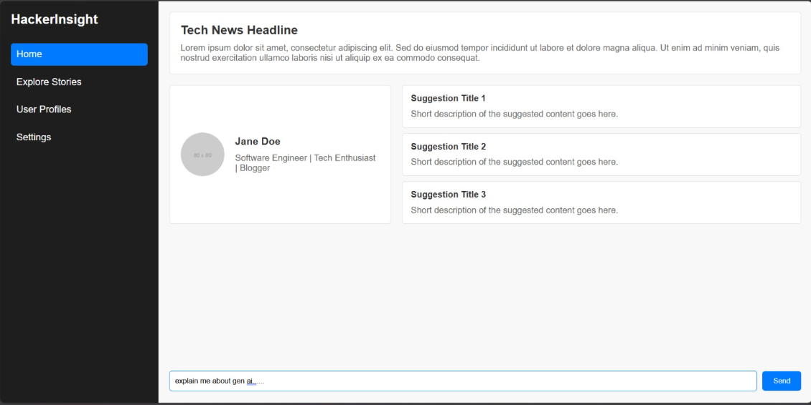

# HackerNews Research Assistant
Multi-Agent AI Researcher This Streamlit app empowers you to research top stories and users on HackerNews using a team of AI assistants with GPT-4o. 
## Objective
HackerInsight is a multi-agent system built using GPT-4, designed to help users research top stories and user profiles from HackerNews. It functions as a dynamic research assistant by leveraging AI agents to summarize and analyze information from HackerNews, making it easier for users to stay updated on key developments.



## Key Features
- **Dynamic Research via AI Agents**: Uses multiple AI agents to collaboratively extract and analyze information from HackerNews, providing a comprehensive research experience.
  
- **Summarization of HackerNews Stories and User Profiles**: Summarizes HackerNews articles and user profiles to save time and provide key insights.
  
- **Streamlit Interface**: Implemented using Streamlit, offering an easy-to-use interface that makes the app user-friendly and intuitive.
  
- **HackerNews API Integration**: Pulls data from HackerNews using their API, ensuring users have access to real-time, relevant stories and information.

## Technologies Used
- **GPT-4**: For generating insightful, context-aware summaries of stories and profiles.
  
- **Streamlit**: For building an interactive web-based user interface.
  
- **HackerNews API**: For fetching real-time data from the HackerNews platform.

## Potential Improvements
- Integration of more sources beyond HackerNews.
  
- Enhanced real-time data analysis capabilities.
  
- Advanced multi-agent collaboration features to improve accuracy and context-awareness.

## Real-World Application
HackerInsight could be used for efficient research in journalism, tech industry analysis, or competitive market research, providing summarized and analyzed insights from a vast array of stories.

## Getting Started
To get started with HackerInsight, follow these steps:

1. **Clone the Repository**:
   ```bash
   git clone https://github.com/jagadesvar/HackerInsight.git
   cd HackerInsight

